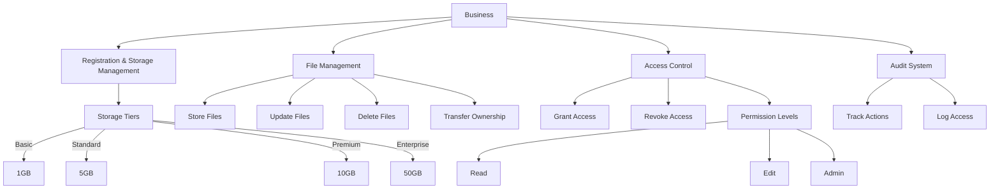

# DataNest Business Storage

A secure, decentralized storage system for small businesses built on the Stacks blockchain, enabling immutable record-keeping and controlled access management without relying on centralized storage providers.

## Overview

DataNest provides essential digital infrastructure for small businesses to:
- Store and manage sensitive file references securely on the blockchain
- Control access permissions for employees and partners
- Maintain detailed audit trails of all data interactions
- Scale storage capacity through a tiered token-based model

The platform is designed to offer enterprise-grade security and compliance features while maintaining the simplicity and cost-effectiveness needed by small businesses.

## Architecture

The DataNest system consists of a primary smart contract that handles:
- Business registration and storage tier management
- File and folder operations
- Access control and permissions
- Comprehensive audit logging



## Contract Documentation

### Main Contract: datanest.clar

#### Core Features:
1. **Business Management**
   - Registration with storage tiers
   - Storage capacity tracking
   - Account activation/deactivation

2. **File Operations**
   - Store file references and metadata
   - Update file information
   - Delete files
   - Transfer file ownership

3. **Access Control**
   - Granular permission levels (Read, Edit, Admin)
   - Grant and revoke access
   - Permission verification

4. **Audit Logging**
   - Comprehensive activity tracking
   - Access monitoring
   - System changes logging

## Getting Started

### Prerequisites
- Clarinet installation
- Stacks wallet
- Basic understanding of Clarity

### Installation
1. Clone the repository
2. Install dependencies
```bash
clarinet install
```

### Basic Usage Examples

1. Register a business:
```clarity
(contract-call? .datanest register-business u1) ;; Register with Basic tier
```

2. Store a file:
```clarity
(contract-call? .datanest store-file "file123" "hash456" "document.pdf" u1000 none)
```

3. Grant access:
```clarity
(contract-call? .datanest grant-file-access "file123" 'ST1PQHQKV0RJXZFY1DGX8MNSNYVE3VGZJSRTPGZGM u1)
```

## Function Reference

### Public Functions

#### Business Management
```clarity
(register-business (tier uint))
(upgrade-storage-tier (new-tier uint))
(deactivate-business)
(reactivate-business)
```

#### File Operations
```clarity
(store-file (file-id string-ascii) (file-hash string-ascii) (file-name string-ascii) (file-size uint) (folder-id optional string-ascii))
(update-file (file-id string-ascii) (new-file-hash string-ascii) (new-file-name optional string-ascii) (new-file-size optional uint) (new-folder-id optional string-ascii))
(delete-file (file-id string-ascii))
```

#### Access Control
```clarity
(grant-file-access (file-id string-ascii) (user principal) (permission-level uint))
(revoke-file-access (file-id string-ascii) (user principal))
```

## Development

### Testing
Run tests using Clarinet:
```bash
clarinet test
```

### Local Development
1. Start local Clarinet console:
```bash
clarinet console
```

2. Deploy contract:
```bash
clarinet deploy
```

## Security Considerations

### Access Control
- Always verify permissions before file operations
- Implement principle of least privilege
- Regularly audit access grants

### Storage Management
- Monitor storage usage
- Implement proper cleanup procedures
- Validate file sizes before storage

### Known Limitations
- File content stored off-chain
- Limited by blockchain transaction speeds
- Map iteration requires off-chain indexing